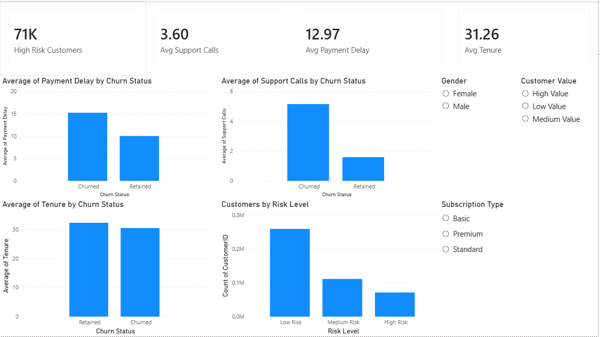

# Customer Churn Analysis

## Project Overview
This project analyzes customer churn behavior using SQL and Power BI.

The main objective of the analysis is to identify:
- Factors affecting customer churn
- High-risk customer segments
- Impact of support calls and payment delays
- Customer value segmentation
- Subscription and contract behavior

---

## Tools Used
- SQL
- Power BI
- Excel

---

## Key Insights
- Customers with high support calls have significantly higher churn rates
- Payment delays are strongly associated with churn
- Monthly contract customers show the highest churn behavior
- Low-value customers are more likely to churn
- Retained customers usually have longer tenure

---

## Dashboard Pages
### 1. Executive Overview
- KPI metrics
- Churn by subscription type
- Customer value analysis
- Risk level analysis

### 2. Risk Analysis
- Support calls analysis
- Payment delay analysis
- Tenure analysis
- High-risk customer distribution

---

## Dashboard Preview

---

## Power BI Dashboard
[View Dashboard](https://app.powerbi.com/links/prH6g8ukTO?ctid=a43125d1-0f89-4fa4-99ab-5474c89fdd42&pbi_source=linkShare)
